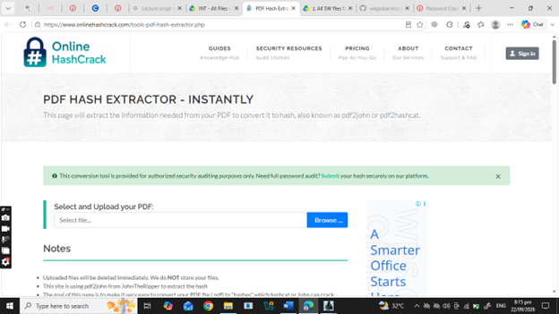
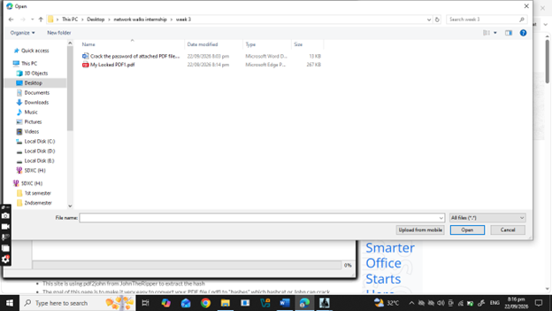
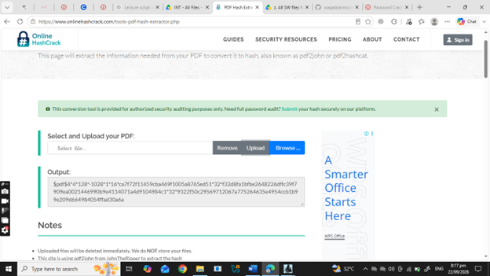
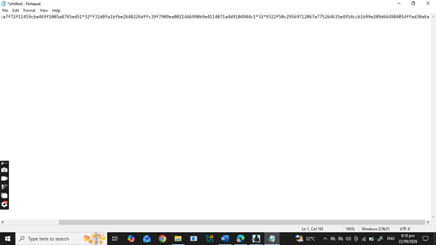
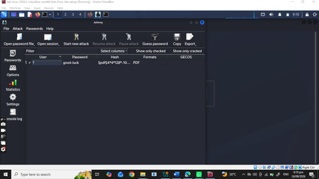
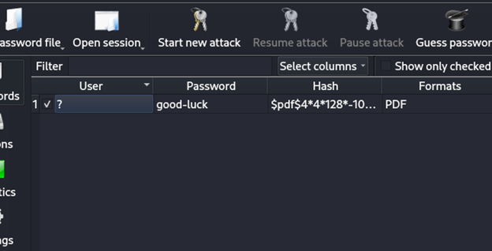
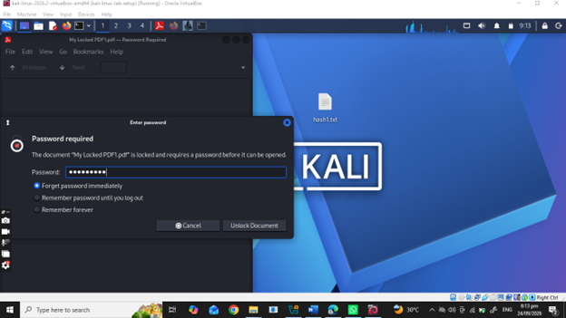

<div align="center">

# 🔐 Password Cracking with John the Ripper

**Recovering the password of a protected PDF using JTR John and JTR Johnny in a controlled cybersecurity lab**

</div>

<p align="center">
  
  
  
  
  
  
  
  
  
  
  
</p>

---

## 📌 Project Overview

This project demonstrates how **John the Ripper (JTR)** and its graphical interface **Johnny** can be used in a controlled cybersecurity laboratory to recover the password of a protected PDF file.

The practical was performed using a Kali Linux virtual machine and a test PDF supplied for the exercise.

The workflow includes:

- Preparing the JTR/Johnny environment
- Obtaining the protected PDF
- Extracting the PDF password hash
- Saving the hash into a text file
- Importing the hash into Johnny
- Starting a password-recovery attack
- Recovering the password
- Using the recovered password to open the protected PDF

John the Ripper is commonly used by security professionals for password-strength testing and supports multiple password-hash formats and protected file types. :contentReference[oaicite:2]{index=2}

---

## 🎯 Objectives

The main objectives of this project are to:

- Understand the basic concept of password cracking.
- Install/use **John the Ripper**.
- Use **Johnny GUI** to interact with JTR.
- Obtain the hash representation of a protected PDF.
- Save the extracted hash into a `.txt` file.
- Import the hash into Johnny.
- Start a controlled password-recovery attack.
- Recover the password of the provided test PDF.
- Verify the recovered password by opening the PDF.
- Document the complete cybersecurity workflow.

---

## 🛡️ Purpose of the Lab

This project is intended for **educational and authorized cybersecurity testing**.

Password-cracking tools can be used to evaluate password security, but they should only be used against files, accounts, systems, or environments that you own or have explicit permission to test.

⚠️ **Important:** Do not use John the Ripper or similar tools to access unauthorized accounts, files, systems, or services.

---

# 🏗️ Lab Environment

The practical was performed inside a virtualized Kali Linux environment.

## ⚙️ Lab Configuration

| 🧩 Component | ⚙️ Configuration |
|---|---|
| 🖥️ Host Platform | Windows PC |
| 🐉 Security OS | Kali Linux |
| 🧰 Virtualization | VirtualBox |
| 🔐 Password Cracking Tool | John the Ripper (JTR) |
| 🖥️ Graphical Interface | Johnny |
| 📄 Target File | My Locked PDF1.pdf |
| 🔎 Hash Extraction | PDF Hash Extractor |
| 📝 Hash File | hash1.txt |
| 🎯 Target Type | Password-Protected PDF |
| 🧪 Lab Environment | Controlled Cybersecurity Lab |
| 🔓 Recovered Password | `good-luck` |

---

#  Practical Procedure

## Step 1. Prepare the Kali Linux Environment

Start the Kali Linux virtual machine inside VirtualBox.

The Kali Linux VM is used as the main environment for the password-security testing exercise.

### Step 2. Prepare John the Ripper

John the Ripper (JTR) is the main password-security testing tool used in this practical.

John the Ripper can be used to test password strength and work with supported password hashes and protected file formats.

Official Website:

```text
https://www.openwall.com/john/
```

In this practical, JTR is used together with the Johnny graphical interface to recover the password of the supplied protected PDF.

---

### Step 3. Open Johnny

Open the **Johnny** graphical interface inside the Kali Linux VM.

Johnny provides a graphical interface for working with John the Ripper.

The main workflow is:

```text
Kali Linux
    ↓
Johnny
    ↓
Open Password File
    ↓
Start New Attack
    ↓
Password Recovery
```


---

### Step 4. Download / Copy the Encrypted PDF

The encrypted PDF supplied for the practical was copied to the Kali Linux VM.

Target file:

```text
My Locked PDF1.pdf
```

The PDF was placed on the Kali Linux desktop.

```text
Protected PDF
      ↓
Kali Linux Desktop
      ↓
My Locked PDF1.pdf
```


The practical task specifies recovering the password of the attached `My Locked PDF1.pdf` using JTR John and JTR Johnny. :contentReference[oaicite:1]{index=1}

---

### Step 5. Open the PDF Hash Extractor

Open the PDF hash extraction website:

```text
https://www.onlinehashcrack.com/tools-pdf-hash-extractor.php
```

Follow these steps:

1. Open the PDF Hash Extractor website.
2. Click the browse/select option.
3. Select `My Locked PDF1.pdf`.
4. Upload the PDF.
5. Wait for the PDF hash to be generated.

Workflow:

```text
My Locked PDF1.pdf
        ↓
PDF Hash Extractor
        ↓
Upload PDF
        ↓
Generated PDF Hash
```



The practical shows the encrypted PDF being uploaded to the hash website to obtain its hash. :contentReference[oaicite:2]{index=2}

---

### Step 6. Select and Copy the Hash

After uploading the PDF, the generated hash value is displayed.

Select and copy the complete hash value.

```text
Generated PDF Hash
        ↓
Select Hash
        ↓
Copy Hash
```

The copied hash will be saved into a text file and later loaded into Johnny.



---

### Step 7. Open Notepad / Text Editor

Open a text editor such as **Notepad**.

Paste the copied PDF hash into the text editor.Save the Hash as `hash1.txt`

```text
Open Notepad
      ↓
Paste PDF Hash
```

The hash should be copied exactly as generated by the PDF hash extractor.



---

### Step 8. Transfer `hash1.txt` to Kali Linux

Transfer the `hash1.txt` file from the host computer to the Kali Linux VM.

Place the file on the Kali Linux desktop.

```text
Host Computer
      │
      │ hash1.txt
      ▼
Kali Linux VM
      │
      ▼
Kali Linux Desktop
```

The practical evidence shows the hash file being transferred to the Kali Linux VM. :contentReference[oaicite:4]{index=4}


---

### Step 9. Open Johnny Inside Kali Linux

Open **Johnny** inside the Kali Linux VM.

Johnny will be used to load the saved hash file.

Inside Johnny, select:

```text
Open Password File
```

Browse to the location of:

hash1.txt
```

Select the file and click:

Open
```





### Step 10. Start a New Attack

After the hash has been successfully loaded, click:

```text
Start New Attack
```

This starts the password-recovery process against the loaded PDF hash.

```text
Loaded Hash
     ↓
Start New Attack
     ↓
Password Recovery
```


The practical explicitly documents the **Start New Attack** step. :contentReference[oaicite:6]{index=6}

---

### Step 11. Wait for Password Recovery

Allow John the Ripper / Johnny to perform the password-recovery process.

The required time can depend on password complexity and computer performance.After the password-recovery process completes, Johnny displays the recovered password.

The submitted practical shows the recovered password as good-luck

```text
Start Attack
     ↓
Processing
     ↓
Password Recovery
     ↓
Recovered Password
```


The project instructions note that password recovery may take some time depending on computer speed and password complexity. :contentReference[oaicite:7]{index=7}

---


### Step 12. Open the Protected PDF

Open the encrypted PDF:

```text
My Locked PDF1.pdf
```

The PDF will display a password prompt because it is protected.enter the recovered password

```text
My Locked PDF1.pdf
        ↓
Password Required
```



---
# 💡 What I Learned

Through this practical, I learned how to use **John the Ripper (JTR)** and **Johnny GUI** to perform password-recovery testing on a password-protected PDF in a controlled cybersecurity lab.

I learned how to:

- Work with John the Ripper and Johnny.
- Extract a PDF hash.
- Save the extracted hash as `hash1.txt`.
- Transfer the hash file into Kali Linux.
- Load the hash file into Johnny.
- Start a new password-recovery attack.
- Identify the recovered password.
- Verify the recovered password by opening the protected PDF.
- Document a complete cybersecurity practical with screenshots and results.

---

# 🐞 Problems Encountered & Solutions

## Problem 1. Password-Protected PDF

The supplied PDF was protected with a password and could not be opened directly.

### Solution

The PDF hash was extracted and processed through the JTR/Johnny workflow in the controlled lab environment.

---

## Problem 2. PDF Hash Required

The protected PDF needed a hash before it could be loaded into Johnny.

### Solution

The PDF was uploaded to the PDF hash extraction tool and the generated hash was copied.

---

## Problem 3. Hash File Transfer

The extracted hash was saved on the host system while the password-recovery process was being performed inside Kali Linux.

### Solution

The `hash1.txt` file was transferred from the host computer to the Kali Linux VM.

---

## Problem 4. Loading the Hash in Johnny

Johnny required the saved hash file before starting the password-recovery process.

### Solution

The `hash1.txt` file was opened through **Open Password File** in Johnny.

---

## Problem 5. Password Recovery Time

The password-recovery process required some processing time.

### Solution

The attack was allowed to continue until the password was recovered.

The practical result showed:

```text
Recovered Password:
good-luck

**# 🛡️ Security & Ethical Use**

This project was performed as a **controlled cybersecurity and ethical-hacking laboratory exercise**.

John the Ripper and similar security tools should only be used against systems, files, accounts, or networks where proper authorization has been granted.

**### ✅ Authorized Use**

- Cybersecurity education
- Personal cybersecurity labs
- Password-security testing
- Authorized penetration testing
- Security research
- Training environments
- Files and systems owned by the tester

**### ❌ Unauthorized Use**

Do not use these tools to:

- Access someone else's files
- Crack unauthorized accounts
- Steal credentials
- Bypass security controls without permission
- Access confidential information
- Attack systems without authorization

> ⚠️ **Always obtain explicit permission before performing security testing against systems, files, accounts, or networks that you do not own.**

---
**
# 👤 Author**

<div align="center">

## **Hamda Raza**

**Cybersecurity Professional B083**

**Cybersecurity & Ethical Hacking**

**Networkwalks**

### 🔗 LinkedIn

[https://www.linkedin.com/in/waqaskarim/](https://www.linkedin.com/in/hamda-rashid-67a157356/)

</div>


